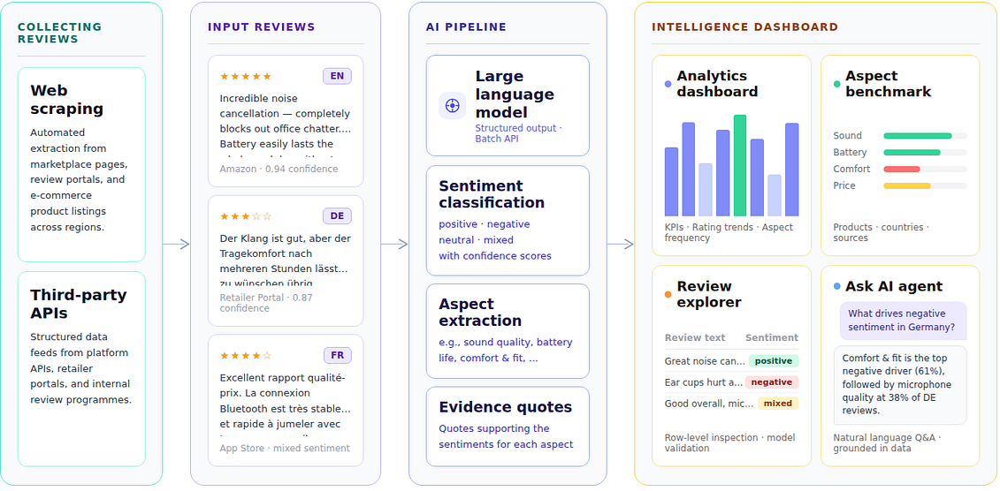

# Product Review Sentiment Analysis Dashboard

This tool turns raw product review data into a structured sentiment dataset that business teams can explore through interactive analytics, aspect benchmarking, row-level review inspection, and natural-language questioning. The workflow is designed for business users who need to move from raw reviews to actionable signals without building a separate reporting pipeline for every new question.



## Overview

This application lets teams upload review data, run GPT-based sentiment and aspect extraction, and analyze the enriched output in a Next.js dashboard.

For sentiment analysis, the uploaded Excel file can contain any number of columns, but it must include these mandatory input columns:
- `review_id`
- `review_title`
- `review_text`

The sentiment pipeline generates these output fields for each review:
- `language`
- `overall_sentiment`
- `overall_confidence`
- `aspects_json`
- `aspect_count`

Those generated sentiment fields are merged back with all columns from the uploaded input table using `review_id` to produce `sentiment_enriched.xlsx`.

Current workflow:
- Open **Sentiment Analysis**.
- Upload a review Excel file if needed.
- Run sentiment analysis.
- Download `sentiment_enriched.xlsx`.
- Explore the active dataset in **Analytics Dashboard**, **Aspect Benchmark**, **Review Explorer**, **Ask Agent**, and **Documentation**.

If no current sentiment dataset is loaded and no fallback file exists at `input/sentiment_enriched.xlsx`, the analytics views and Ask Agent report that no input data is available.


## Project Structure

```text
Product Review Analysis Dashboard/
|-- backend/                  # FastAPI app, sentiment pipeline, analytics APIs, AI agent
|   |-- main.py               # API routes
|   |-- pipeline_sentiment.py # Sentiment analysis pipeline
|   |-- analytics.py          # Dashboard aggregations and metrics
|   |-- data_agent.py         # Ask Agent implementation
|   |-- product_summaries.py  # Cached summary generation
|   |-- runtime_store.py      # In-memory + fallback sentiment dataset store
|   |-- sentiment_prompts.py  # Sentiment prompts and aspect schema
|   |-- config.py             # Provider and settings management
|   |-- requirements.txt
|   `-- Dockerfile
|-- frontend/                 # Next.js frontend application
|   |-- src/
|   |   |-- app/             # App Router entrypoints and global styles
|   |   |-- views/           # Analytics, Benchmark, Explorer, Ask Agent, Sentiment Analysis, Documentation
|   |   |-- components/      # Layout, charts, and reusable UI pieces
|   |   `-- lib/api.js       # Frontend API client
|   |-- public/
|   |   `-- logo.png
|   |-- package.json
|   `-- Dockerfile
|-- input/                    # Fallback dataset files and cached summaries
|-- docker-compose.yml
|-- settings.json             # Selected API provider (azure/openai)
`-- README.md
```

## Running Locally

Clone the repository:

```bash
git clone https://github.com/umairalipathan1980/Product-Review-Sentiment-Analysis.git
cd Product-Review-Sentiment-Analysis
```

Create `backend/.env` from `backend/.env.example` if you want to run sentiment analysis.

```env
# Azure OpenAI
AZURE_API_KEY=...
AZURE_ENDPOINT=https://your-resource.openai.azure.com/
AZURE_API_VERSION=2025-03-01-preview
AZURE_DEPLOYMENT=your-deployment-name

# OpenAI (alternative)
OPENAI_API_KEY=...
OPENAI_MODEL=your-model-name
```

Start the backend:

```bash
cd backend
python -m venv venv
venv\Scripts\activate
pip install -r requirements.txt
python -m uvicorn main:app --reload --port 8000
```

Start the frontend in a second terminal:

```bash
cd frontend
npm install
npm run dev
```

URLs:
- Frontend: `http://localhost:3000`
- Backend: `http://localhost:8000`

## Running With Docker

Prerequisites:
- Docker Desktop or Docker Engine with Compose
- Optional API credentials in `backend/.env` if you want sentiment analysis enabled

Start the stack:

```bash
docker compose up --build
```

Stop the stack:

```bash
docker compose down
```

URLs:
- Frontend: `http://localhost:5173`
- Backend: `http://localhost:8000`

Notes:
- `backend/.env` is injected into the backend container when present.
- `input/` is mounted into the backend container as `/app/input`.
- `settings.json` is mounted into the backend container for provider selection.
- The frontend container runs Next.js on port `3000` internally and is published to host port `5173`.

## Data Files

The app can work with either the latest in-memory sentiment result produced during the current session or a fallback file at `input/sentiment_enriched.xlsx`. In practice, this means the dashboard and Ask Agent can use the most recent sentiment run immediately, while still supporting a saved fallback dataset for later review.

Related files include `input/sentiment_enriched.xlsx`, which acts as the optional fallback dataset for the dashboard and Ask Agent, and `input/product_summaries.json`, which stores cached AI-generated summaries for Analytics filters.

## How to Change the Dataset

If the new dataset already uses the same required columns and the same saved output contract, nothing in the code needs to be changed. In that case, upload the new review file in **Sentiment Analysis**, generate a new enriched file, and replace `input/sentiment_enriched.xlsx`.

If the new dataset does not follow the current schema, the following changes are needed:

- The input review file used for sentiment analysis must provide `review_id`, `review_title`, and `review_text`. If your dataset uses different names, rename those columns before upload or update the input column selection in `backend/pipeline_sentiment.py`.
- After generating the new enriched dataset, save or download it as `input/sentiment_enriched.xlsx` so the dashboard, benchmark views, review explorer, summaries, and Ask Agent use the new data as their saved fallback dataset.
- Clear or regenerate `input/product_summaries.json` so cached summaries from the old dataset do not carry over.
- If the enriched dataset itself uses different column names and you want Ask Agent to work with them, update the hardcoded field mappings in `backend/data_agent.py`.

## How to Run and Save Sentiment Analysis

The first step is to collect product reviews from the sources your team already uses. These may come from web scrapers, marketplace exports, retailer portals, third-party review services, internal review programs, or Amazon APIs. Before running sentiment analysis, these reviews should be combined into a single Excel table.

The uploaded Excel file may contain any number of business columns, but the sentiment pipeline requires three mandatory fields: `review_id`, `review_title`, and `review_text`. The `review_id` field is used to connect the generated sentiment output back to the original row, `review_title` provides the short review headline, and `review_text` contains the main review body that the model analyzes for sentiment, aspects, and evidence.

Once the file is ready, the user opens the **Sentiment Analysis** page, selects the API provider if needed, uploads the review file, and runs the analysis. The tool then processes the reviews and generates structured sentiment output for each review. The generated fields are `language`, `overall_sentiment`, `overall_confidence`, `aspects_json`, and `aspect_count`. These generated fields are merged back into the uploaded review table by `review_id` to create `sentiment_enriched.xlsx`.

A key part of the sentiment pipeline is the aspect taxonomy defined in `backend/sentiment_prompts.py`. In that file, the `class AspectType` enum defines the allowed aspect categories that the model can use when assigning aspect-level sentiment. This means the model does not invent arbitrary aspect names. Instead, it must choose from the predefined closed set used by the application. The same file also contains `ASPECT_DESCRIPTIONS`, which explains what each aspect category is intended to cover.

The aspect types in the example dataset are defined as follows.

| Aspect Type | Definition |
| --- | --- |
| `SOUND_QUALITY` | General audio performance, bass, treble, clarity, and soundstage. |
| `NOISE_CANCELLATION` | Active noise cancellation effectiveness, ambient noise blocking, and transparency mode. |
| `COMFORT_FIT` | Wearing comfort, ear cup pressure, fit stability, and long-session fatigue. |
| `BATTERY_LIFE` | Battery duration, charging speed, standby drain, and battery longevity over time. |
| `BUILD_DURABILITY` | Construction, materials, hinge strength, durability, and craftsmanship. |
| `CONNECTIVITY` | Bluetooth stability, pairing speed, multipoint support, range, and audio dropouts. |
| `MICROPHONE_QUALITY` | Call clarity, voice pickup, background noise rejection, and video call performance. |
| `USE_CASE` | Specific usage situations such as commuting, gym, travel, or gaming. |
| `PRICE_VALUE` | Price, value for money, and whether the product feels worth the cost. |
| `BRAND_TRUST` | Brand reputation and expected quality. |

In practice, each extracted aspect written into `aspects_json` is expected to use one of those `AspectType` values, along with an aspect-level sentiment label, a supporting evidence quote from the review text, and a confidence score. This keeps aspect-level analysis consistent across the dashboard, benchmark views, summaries, and Ask Agent.

When processing finishes, the enriched file can be downloaded and reused as the saved dataset for the rest of the application. That saved output is the dataset used by the dashboard, benchmark views, review explorer, summaries, and Ask Agent.

## How the Dashboard Works

Every page reads from the same sentiment-enriched dataset, but each page answers a different business question. The value of the application comes from being able to move from high-level performance monitoring to detailed review inspection without leaving the same shared data context.

### Analytics Dashboard

The **Analytics Dashboard** is the main decision-making page. It brings together review volume, rating performance, sentiment movement, and aspect-level discussion so that users can understand both what customers are saying and how those signals change over time. The normal starting point is the **Analyze by** control, which changes the scope of the page to views such as Overall, Country, Source, Model, Product, Generation, or Region.

Once the scope is selected, the KPI cards summarize how many reviews are in the current slice, what the average rating looks like, and how sentiment is distributed. The rating and sentiment trend charts help show whether customer perception is stable, improving, or deteriorating over time. The aspect frequency section shows which product dimensions customers talk about most and whether the tone is more positive or negative.

The page also includes an insight summary for the current scope and inline AI interpretation panels inside chart cards. Those interpretations are meant to translate visible chart patterns into business language without forcing the user to manually explain the chart to themselves first.

### Aspect Benchmark

The **Aspect Benchmark** page is used when the goal is comparison rather than monitoring. Instead of looking at one slice of the data in isolation, this page helps users compare aspect-level performance across products, countries, sources, or the overall dataset.

This is especially useful when one team wants to understand where one product outperforms another, where one market is more negative than another, or which aspects consistently emerge as strengths and weaknesses across segments. The page is designed to support side-by-side comparison, so it is typically the place to go after a pattern is discovered in Analytics and needs to be compared more explicitly across business dimensions.

### Review Explorer

The **Review Explorer** page is the row-level inspection surface. It is intended for situations where users want to move beyond aggregated metrics and read the underlying reviews that produced those metrics. This page is useful for validating model behavior, auditing specific complaints, or understanding how customers actually describe a product issue in their own words.

Users can search and filter the review table by relevant business dimensions and sentiment categories, then open individual reviews to inspect metadata and extracted aspect information. This makes the page useful not only for quality checking but also for translating a chart signal into specific examples that internal teams can read directly.

### Ask Agent

The **Ask Agent** page is designed for natural-language exploration of the current sentiment dataset. Instead of manually building filters or reading multiple charts, users can ask direct business questions such as what the top complaints are, how one region compares with another, which aspects are strongest, or how sentiment changed over time.

The answers are grounded in the currently loaded sentiment-enriched dataset rather than in generic product knowledge. This makes the page useful for follow-up analysis after reviewing the dashboard. Internally, Ask Agent reads the current sentiment dataset into a pandas dataframe and uses its built-in analysis tools to filter, compare, summarize, and inspect the review data before writing the final answer. If no current sentiment dataset is available, the page clearly reports that no input data is found.

Ask Agent uses the following built-in tools to answer questions against the loaded dataset.

| Tool | What It Does |
| --- | --- |
| `get_schema` | Returns the dataset schema, supported filter fields, groupable fields, metrics, and sample values. |
| `get_aspect_summary` | Summarizes aspect mention counts and sentiment breakdowns, optionally within filters or a sentiment slice. |
| `aggregate_reviews` | Computes grouped metrics such as review count, average rating, and sentiment rates. |
| `find_reviews` | Retrieves individual review rows when the user asks for examples, evidence, or quotes. |
| `explain_negative_drivers` | Identifies the aspects most associated with negative sentiment for a selected product or source. |
| `get_time_trends` | Shows how ratings or sentiment change over time, optionally for a specific aspect. |
| `compare_segments` | Compares metrics side by side across selected values of one dimension such as source, country, or product. |
| `detect_anomalies` | Flags statistical outliers in a dimension based on metrics such as negative rate or average rating. |
| `explain_sentiment_drivers` | Finds the top aspects associated with positive, negative, or neutral sentiment. |
| `statistical_comparison` | Tests whether two filtered groups differ significantly on a selected metric. |
| `analyze_correlations` | Finds which dimensions are most strongly associated with a target metric. |
| `search_review_text` | Searches review title and text content for keywords or phrases. |
| `get_top_keywords` | Returns the most frequent keywords in the filtered review set after stop-word filtering. |
| `get_aspect_cooccurrence` | Identifies aspects that appear together in the same reviews. |
| `run_pandas_code` | For analysis cases not covered by the existing tools, the agent generates the analysis code which is run by the `run_pandas_code` tool. |

### Sentiment Analysis

The **Sentiment Analysis** page is the operational entry point for processing review data. It allows users to select the API provider, upload a review file, run the sentiment pipeline, preview the resulting enriched table, and download the saved output.

This page is where the raw review table becomes the analysis-ready dataset used everywhere else in the tool. In practice, it is the first page used when new review data is introduced and the page revisited whenever the dataset needs to be refreshed.


